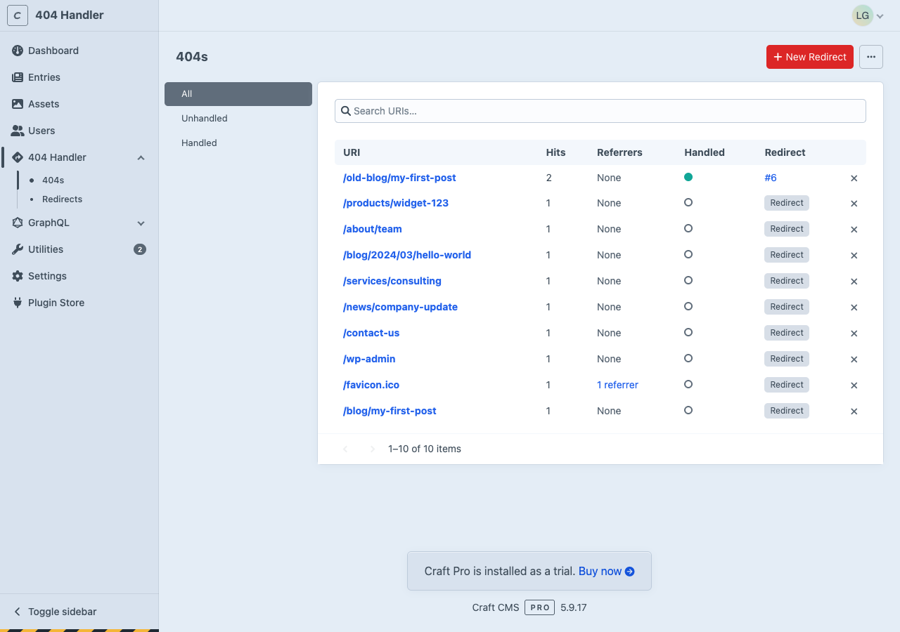
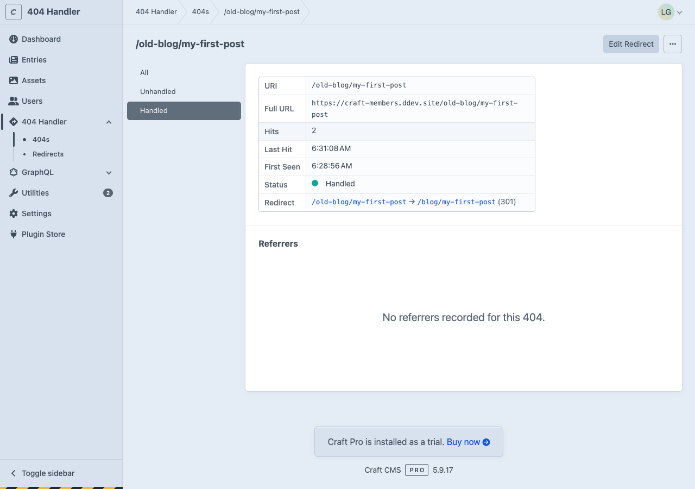
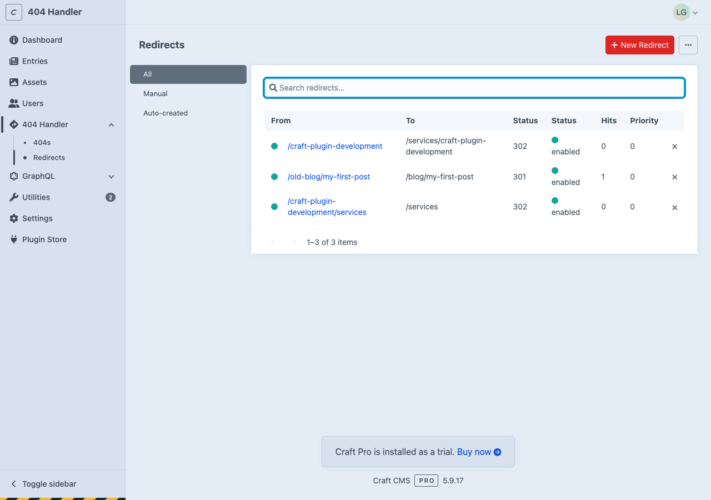
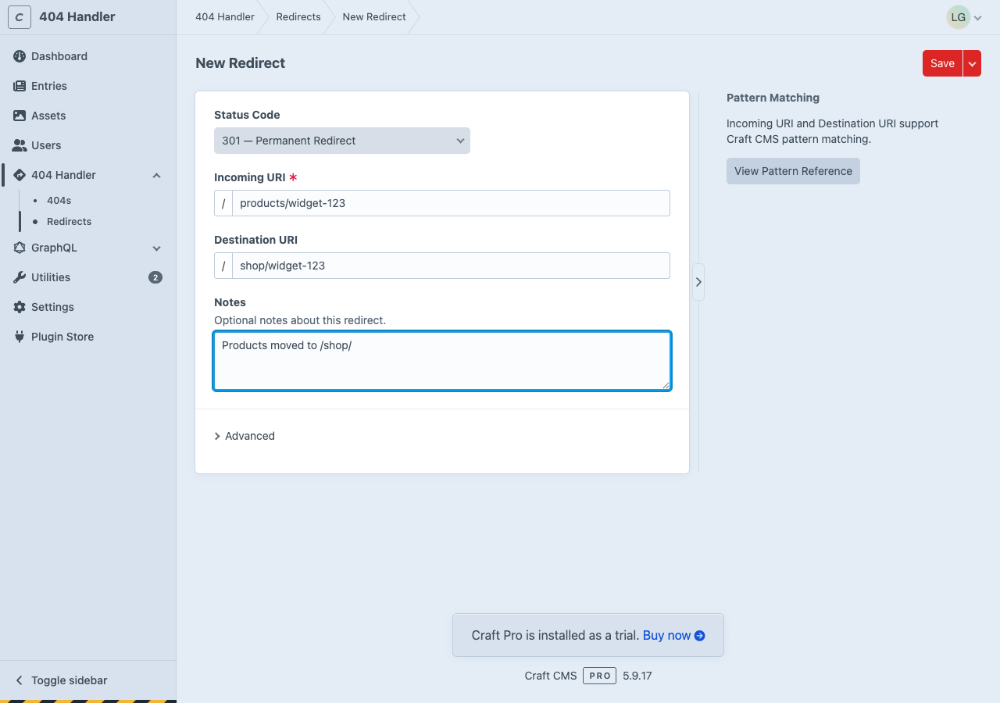
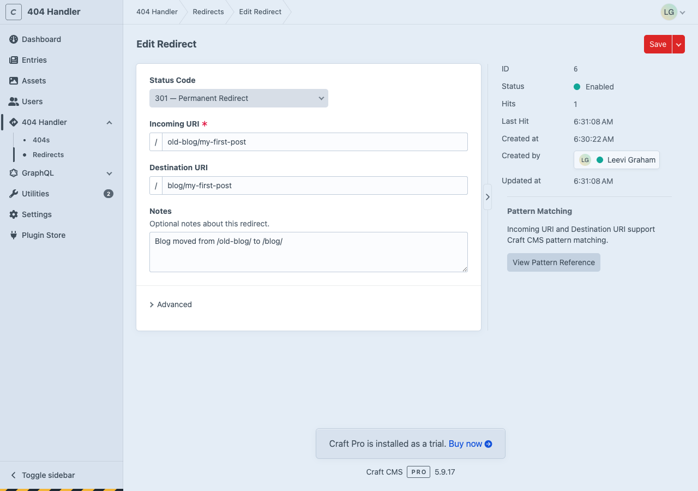
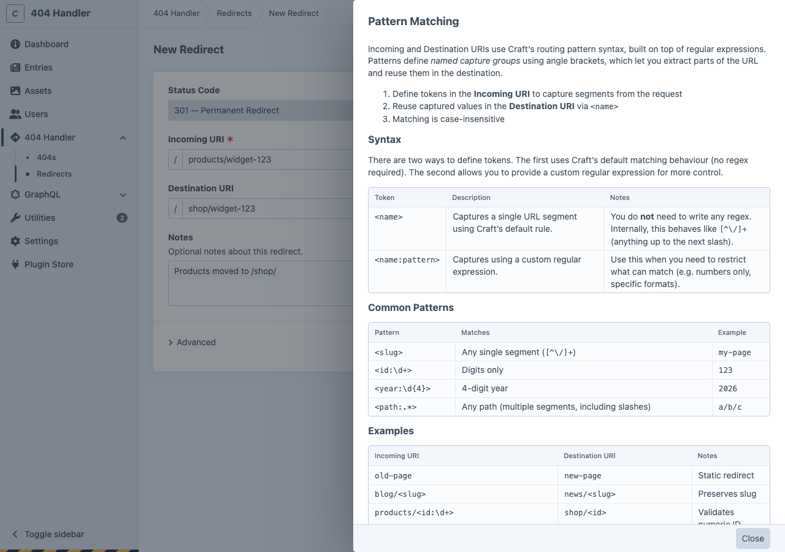
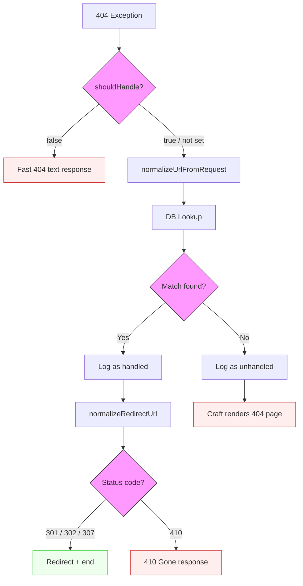

<p align="center"></p>
<h1 align="center">404 Redirects for Craft CMS 5.x</h1>

Catches 404 errors and redirects visitors to the right page. When someone hits a broken link — whether from a renamed
page, an old bookmark, or an external site linking to a URL that no longer exists — this plugin intercepts the 404,
checks your redirect rules, and sends the visitor where they need to go.

Built for performance — uses direct database queries and models instead of the element system.

## Features

- **404 Interception**: Catches every 404 on your site and checks it against your redirect rules before the error page
  renders
- **Auto-Redirects on URI Change**: When an editor renames a page, a redirect is automatically created from the old URL
  to the new one — with chain flattening so old URLs always point to the latest destination
- **Redirect Rules**: Create redirect rules with Craft's native `<param>` pattern matching syntax (exact match and
  regex)
- **Entry Destinations**: Select a Craft entry as the redirect destination — the URL resolves dynamically and updates automatically when the entry's URI changes
- **Notes**: Timestamped, author-attributed notes on redirects. System-generated notes track URI changes and entry deletions
- **404 Logging**: Tracks every 404 with hit counts, referrer audit trail, and handled/unhandled status
- **Loop Detection**: Validates redirect chains at save time to prevent circular redirects
- **Referrer Tracking**: Audit trail of where broken links originate, persisted even after 404s are redirected
- **Configurable Pipeline**: Config callbacks for gating, URI normalization, and redirect URL transformation
- **Scheduled Redirects**: Start/end date support for time-limited redirects
- **GraphQL API**: Query 404s and redirects via GraphQL with schema-level permissions
- **CSV Export/Import**: Export 404s and redirects as CSV, import redirects from CSV (CP and CLI)
- **Retour Migration**: CLI command to import existing data from the Retour plugin
- **CLI Commands**: Export, import, reprocess, and migrate via console commands
- **410 Gone Support**: Return proper 410 status codes for permanently removed content
- **Dry-Run Mode**: Run the full pipeline without executing redirects — useful for testing alongside another redirect
  plugin
- **User Permissions**: Granular permissions for viewing 404s, managing redirects, and deleting records

## Requirements

- Craft CMS 5.9.0+
- PHP 8.4+
- PostgreSQL or MySQL

## Installation

> **Beta:** This plugin is in beta. The API is stable but hasn't been widely tested in production. Please [report issues](https://github.com/newism/craft-not-found-redirects/issues).

Since this is a pre-release, you need to specify the version explicitly:

```bash
composer require newism/craft-not-found-redirects:1.0.0-beta.2
craft plugin/install not-found-redirects
```

## How It Works

### 404 Interception

The plugin hooks into Craft's `ErrorHandler::EVENT_BEFORE_HANDLE_EXCEPTION` event — this fires **before** the error page
renders, giving the plugin a chance to redirect instead. When a 404 occurs:

1. The `shouldHandle` config callback is checked (if set) — return `false` for a fast minimal 404 response
2. The URI is normalized via `normalizeUrlFromRequest` callback, or defaults to `$request->getFullPath()` (path only, no
   query params)
3. Exact-match redirects are checked first via a fast SQL query (filtered by `enabled`, `siteId`, `startDate`/`endDate`)
4. If no exact match, regex pattern redirects are loaded and tested in priority order
5. If a match is found, the 404 is logged as "handled" and the visitor is redirected
6. If no match is found, the 404 is logged as "unhandled" and the error page renders normally
7. The referrer (if present) is recorded for audit

### Auto-Redirects on URI Change

When an element's URI changes, the plugin automatically creates a 301 redirect from the old URL to the new one. This
covers:

- **Slug changes** — editor renames an entry in the CP
- **Structure moves** — entry dragged to a new position, changing its path
- **Parent renames** — parent entry's slug changes, cascading new URIs to all descendants

If the same element's URI changes multiple times, existing redirects are updated to point directly to the latest URL (
chain flattening) — so visitors following any old link get to the right page in a single hop.

Auto-redirects are **not** created for:

- New elements (no old URI to redirect from)
- Drafts and revisions
- Duplications ("Save as new entry")
- Bulk resaves (e.g. when a section's URI format changes)
- Elements being propagated to other sites

Controlled by the `createUriChangeRedirects` setting (default: on).

### Loop Detection

When saving a redirect, the plugin traces the redirect chain to detect loops (A → B → C → A) using the same pattern
matching as live requests. Self-redirects (A → A) are also blocked. At runtime, a guard prevents redirecting to the
current URL.

## Control Panel

The plugin adds a "404 Redirects" section to the CP global sidebar with three subnav items:

### 404s

Lists all captured 404 errors with search, sort, and pagination. Page sidebar filters:

- **All** — every 404
- **Unhandled** — 404s without a matching redirect
- **Handled** — 404s matched by a redirect rule



Each 404 links to a detail page showing:

- URI, full URL, hit count, last hit, first seen, handled status
- Link to the associated redirect rule (if handled)
- Referrers table with paginated list of referring URLs
- "Create Redirect" or "Edit Redirect" button in the header
- "..." menu with delete referrers/404 actions



### Redirects

Lists all redirect rules with search, sort, and pagination. Page sidebar filters:

- **All** — every redirect
- **Manual** — redirects created by hand
- **System Generated** — redirects created automatically when element URIs change



Create redirects with:

- **Incoming URI**: URI pattern (supports `<param>` syntax for regex matching)
- **Destination**: Choose between URL or Entry
  - **URL**: Relative path or full external URL. Local site URLs are automatically normalized to paths
  - **Entry**: Select a Craft entry. The redirect resolves the entry's live URL at redirect time; if the entry is deleted, falls back to the cached URI
- **Status Code**: 301, 302, 307, or 410
- **Notes**: Timestamped notes with author avatars. Add notes via a modal dialog. System-generated notes track URI changes and entry deletions automatically

Advanced options (collapsed by default):

- **Resolved Entry URI**: Shows the cached URI for entry-type destinations (readonly)
- **Priority**: Higher values are checked first
- **Enabled**: Toggle on/off
- **Start/End Date**: Schedule when the redirect is active
- **Site**: Restrict to a specific site (multi-site only)



The meta sidebar on the redirect edit screen shows: ID, status, hit count, created at/by (with user chip), updated at,
destination entry chip (for entry-type redirects), and source element chip for system-generated redirects.

When editing an entry that has incoming redirects, an "Incoming Redirects" section appears in the entry's sidebar showing all redirects targeting it.



### Logs

View the plugin's log files directly in the CP. A dropdown selects between available log files (rotated daily, 14-day retention). Only files matching the plugin's log prefix are shown.

## Permissions

The plugin registers five permissions under the "404 Redirects" heading:


| Permission                          | Description               |
|-------------------------------------|---------------------------|
| `not-found-redirects:view404s`        | View the 404s listing     |
| `not-found-redirects:delete404s`      | Delete 404 records        |
| `not-found-redirects:manageRedirects` | Create and edit redirects |
| `not-found-redirects:deleteRedirects` | Delete redirects          |
| `not-found-redirects:viewLogs`        | View plugin logs          |

The CP nav items are permission-gated: "404s" requires `view404s`, "Redirects" requires `manageRedirects` or
`deleteRedirects`, "Logs" requires `viewLogs`. If a user has no relevant permissions, the plugin nav item is hidden entirely.

## Dry-Run Mode

Set `'dryRun' => true` in your config to run the full 404 pipeline without executing redirects. The plugin will still
log 404s and referrers, but will skip the actual redirect. Useful for testing alongside Retour or another redirect
plugin before switching over.

## Pattern Matching

Redirect rules use Craft's built-in `RedirectRule` class for matching. A pattern reference slideout is available from
the redirect edit screen's meta sidebar.



### Exact Match (case-insensitive)

```
old-page  ->  new-page
about/team  ->  team
```

### Named Parameters

Named parameters use angle brackets to capture URL segments. Without a regex, `<name>` matches any single path segment (
`[^\/]+`):

```
blog/<slug>  ->  news/<slug>
```

Add a regex after the colon for more control:

```
products/<id:\d+>  ->  shop/<id>
blog/<year:\d{4}>/<month:\d{2}>/<slug>  ->  news/<year>/<month>/<slug>
old/<path:.*>  ->  new/<path>
```

## GraphQL

The plugin registers four root queries. Enable "Query for 404 Redirects data" in your GraphQL schema settings.

```graphql
# List 404s (with optional filtering)
{
  notFoundRedirects404s(handled: false, limit: 10, offset: 0) {
    id uri fullUrl hitCount hitLastTime handled redirectId referrerCount dateCreated
  }
}

# Single 404 by ID or URI
{
  notFoundRedirects404(id: 1) {
    id uri fullUrl hitCount handled referrerCount
  }
}

# List redirect rules
{
  notFoundRedirectsRedirects(limit: 10) {
    id from to toType toElementId statusCode priority enabled startDate endDate
    systemGenerated elementId createdById hitCount dateCreated
  }
}

# Single redirect by ID
{
  notFoundRedirectsRedirect(id: 1) {
    id from to toType toElementId statusCode enabled systemGenerated hitCount
  }
}
```

DateTime fields return ISO 8601 format (e.g. `2026-03-21T16:17:45-07:00`).

## CLI Commands

All commands support `--output-format=table|json|csv` for structured output. Mutating commands support `--dry-run` to preview changes without executing them.

### Export

```bash
# Export redirects as a table to stdout (default)
craft not-found-redirects/redirects/export-redirects
```
```
 From  To                        Type   Status  Enabled  Hits
 ----  ------------------------  -----  ------  -------  ----
 test  craft-plugin-development  entry  302     Yes      0

  Redirect(s): 1
```

```bash
# Export as JSON (for scripting / AI consumption)
craft not-found-redirects/redirects/export-redirects --output-format=json
```
```json
{
    "dryRun": false,
    "summary": { "total": 1 },
    "items": [
        {
            "from": "test",
            "to": "craft-plugin-development",
            "toType": "entry",
            "statusCode": 302,
            "enabled": true,
            "hitCount": 0
        }
    ]
}
```

```bash
# Export to CSV file
craft not-found-redirects/redirects/export-redirects --output-file=redirects.csv

# Export 404s
craft not-found-redirects/redirects/export-404s
craft not-found-redirects/redirects/export-404s --output-format=json
craft not-found-redirects/redirects/export-404s --output-file=404s.csv
```

### Import

```bash
# Import redirects from CSV
craft not-found-redirects/redirects/import-redirects --input-file=redirects.csv
```
```
 From       To         Status  Result    Error
 ---------  ---------  ------  --------  -----
 old-page   new-page   301     imported
 /broken    /fixed     302     imported

  Imported: 2
  Skipped: 0
  Errors: 0
```

```bash
# Dry run — validate without saving
craft not-found-redirects/redirects/import-redirects --input-file=redirects.csv --dry-run
```
```
 From       To         Status  Result        Error
 ---------  ---------  ------  ------------  -----
 old-page   new-page   301     would import
 /broken    /fixed     302     would import

  Would import: 2
  Would skip: 0
  Errors: 0
```

Each imported redirect gets a system note "Imported from CSV". If the CSV has a `Note` column, that note is also attached.

### Reprocess

Re-evaluate unhandled 404s against current redirect rules:

```bash
craft not-found-redirects/redirects/reprocess
craft not-found-redirects/redirects/reprocess --dry-run
craft not-found-redirects/redirects/reprocess --dry-run --output-format=json
```

### Purge

Delete stale 404s and their orphaned system-generated redirects:

```bash
# Purge 404s not seen in 90 days
craft not-found-redirects/redirects/purge-404s --last-seen="-90 days"
```
```
 URI         Hits  Last Seen
 ----------  ----  -------------------
 old-page    5     2025-01-15 10:30:00
 broken-link 2     2025-02-03 14:22:11

  Deleted 404(s): 2
  Deleted referrer(s): 8
  Deleted redirect(s): 1
```

```bash
# Dry run — see what would be deleted
craft not-found-redirects/redirects/purge-404s --last-seen="-90 days" --dry-run
```
```
  Would delete 404(s): 2
  Would delete referrer(s): 8
  Would delete redirect(s): 1
```

```bash
# JSON output for scripting
craft not-found-redirects/redirects/purge-404s --last-seen="-90 days" --dry-run --output-format=json
```

`--last-seen` is required and accepts any `strtotime()`-compatible string (e.g. `-90 days`, `-6 months`, `2025-01-01`).

## Migrating from Retour

If you're replacing the [Retour](https://github.com/nystudio107/craft-retour) plugin, you can migrate its 404 stats and
redirect rules into this plugin via CLI:

```bash
# Migrate both 404s and redirect rules
craft not-found-redirects/migrate/retour

# Dry run — see what would be migrated
craft not-found-redirects/migrate/retour --dry-run

# JSON output
craft not-found-redirects/migrate/retour --output-format=json

# Migrate only 404 stats
craft not-found-redirects/migrate/retour-404s

# Migrate only redirect rules
craft not-found-redirects/migrate/retour-redirects
```

The migration:

- Imports 404 stats from `retour_stats` including hit counts and referrers
- Imports static redirect rules from `retour_static_redirects` with status codes and priorities
- Skips records that already exist (by URI) — safe to run multiple times
- Use `--skip-existing=0` to merge hit counts into existing records instead of skipping
- Retour tables must still exist when running the migration (uninstall Retour *after* migrating)
- All commands support `--dry-run` and `--output-format=json`

## Configuration

Copy the sample config from the plugin to your project:

```bash
cp vendor/newism/craft-not-found-redirects/src/config.php config/not-found-redirects.php
```

See `src/config.php` for a fully commented template with examples.

### Settings

| Setting                    | Type             | Default | Description                                                            |
|----------------------------|------------------|---------|------------------------------------------------------------------------|
| `shouldHandle`             | `callable\|null` | `null`  | Gate — return `false` to skip plugin entirely (fast 404 text response) |
| `normalizeUrlFromRequest`  | `callable\|null` | `null`  | Custom URI normalization for DB matching                               |
| `normalizeRedirectUrl`     | `callable\|null` | `null`  | Post-process redirect destination URL                                  |
| `createUriChangeRedirects` | `bool`           | `true`  | Auto-create redirects when element URIs change                         |
| `dryRun`                   | `bool`           | `false` | Log pipeline results without executing redirects                       |
| `autoRedirectStatusCode`   | `int`            | `302`   | Status code for auto-created redirects (301 or 302)                    |

### Examples

**Gate out bot probes** — fast minimal response, no DB or template overhead:

```php
'shouldHandle' => function(\craft\web\Request $request): bool {
    if (preg_match('#^(wp-|\.env|\.git|xmlrpc)#i', $request->getFullPath())) {
        return false;
    }
    return true;
},
```

**Preserve query params for search pages:**

```php
'normalizeUrlFromRequest' => function(\craft\web\Request $request): string {
    $uri = $request->getFullPath();
    $q = $request->getQueryParam('q');
    if ($q !== null) {
        $uri = \craft\helpers\UrlHelper::urlWithParams($uri, ['q' => $q]);
    }
    return $uri;
},
```

**Preserve original query string on redirects:**

```php
'normalizeRedirectUrl' => function(string $destinationUrl, string $matchedUri, \newism\notfoundredirects\models\Redirect $redirect): string {
    $params = \Craft::$app->getRequest()->getQueryParams();
    return \craft\helpers\UrlHelper::urlWithParams($destinationUrl, $params);
},
```

## Pipeline

Every 404 flows through this pipeline. Config callbacks bookend the plugin's core logic:

```
1. shouldHandle($request) → bool                    [CONFIG]
   false → minimal "404 Not Found" text + end()

2. normalizeUrlFromRequest($request) → string $uri  [CONFIG]
   Default: $request->getFullPath()

3. DB lookup: match $uri against redirect rules     [PLUGIN]
   Match → log, transform, redirect
   No match → log, let Craft render 404

4. normalizeRedirectUrl($url, $matchedUri, $redirect) [CONFIG]
   Default: return $url unchanged
```



## CSV Format

### Export

Available from the "..." action menu on 404s and Redirects pages, and via CLI.

### Import

Available from the "..." action menu on the Redirects page, and via CLI. CSV must have a header row:

| Column           | Required | Description                                       |
|------------------|----------|---------------------------------------------------|
| From             | Yes      | The URI pattern to match                          |
| To               | No       | Destination URI or full URL (empty for 410)       |
| To Type          | No       | `url` or `entry` (default: url)                   |
| To Element ID    | No       | Entry element ID (when To Type is `entry`)        |
| Status Code      | No       | 301, 302, 307, or 410 (default: 302)             |
| Priority         | No       | Higher = checked first (default: 0)               |
| Enabled          | No       | true/false or 1/0 (default: true)                 |
| System Generated | No       | true/false or 1/0 (default: false)                |
| Start Date       | No       | When the redirect becomes active                  |
| End Date         | No       | When the redirect stops being active              |
| Note             | No       | A note to attach to the redirect                  |

Column names are flexible: accepts both `From`/`from`, `Status Code`/`statusCode`, etc.

Each imported redirect automatically gets a system note "Imported from CSV". If a Note column value is present, it's added as an additional note.

## Feed Me

Feed Me integration is not supported. Feed Me requires Craft element types, and this plugin uses direct database tables
for performance. Use the CSV import (CP or CLI) instead.

## Database Tables

- `notfoundredirects_redirects` — Redirect rules (with `toType`/`toElementId` for entry destinations)
- `notfoundredirects_notes` — Timestamped notes per redirect (one-to-many, with author and `systemGenerated` flag)
- `notfoundredirects_404s` — Captured 404 records (aggregated by uri + siteId)
- `notfoundredirects_referrers` — Referrer audit trail (aggregated by notFoundId + referrer)

## Architecture

- **No elements, no ActiveRecord** — Models + direct DB commands for performance
- **Models** use `DateTime` properties with `fromRow()` factory methods for type-safe hydration
- **Services** return `Illuminate\Support\Collection<Model>` — shared by CP, CLI, CSV, and GraphQL
- **VueAdminTable** with server-side JSON endpoints for paginated CP tables
- **Dedicated Monolog log target** at `storage/logs/not-found-redirects-*.log`
