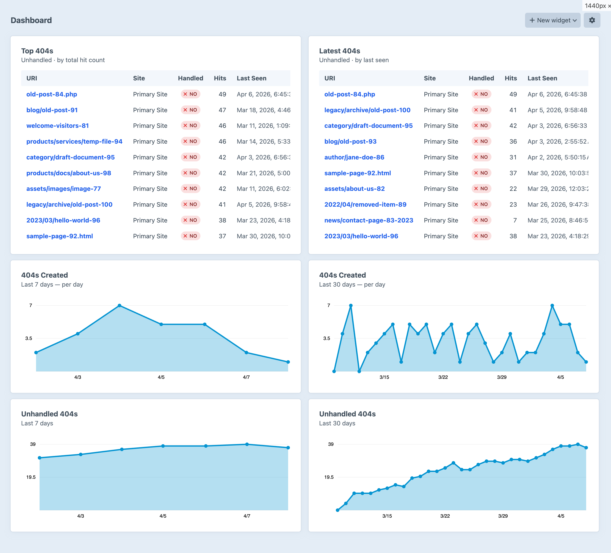
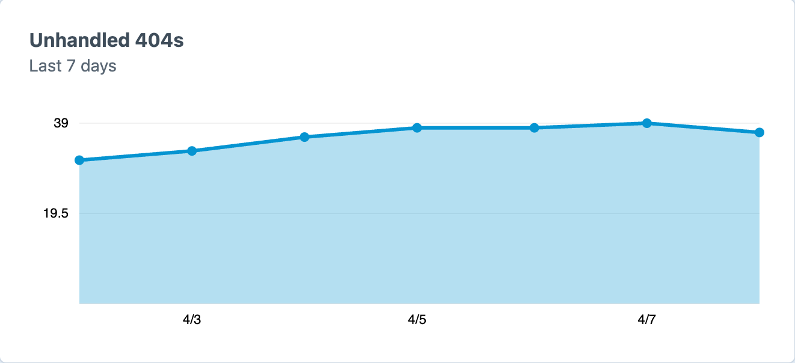
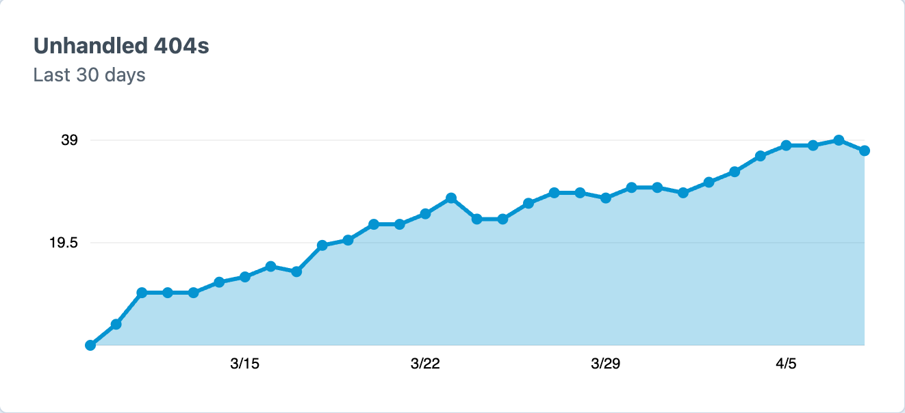
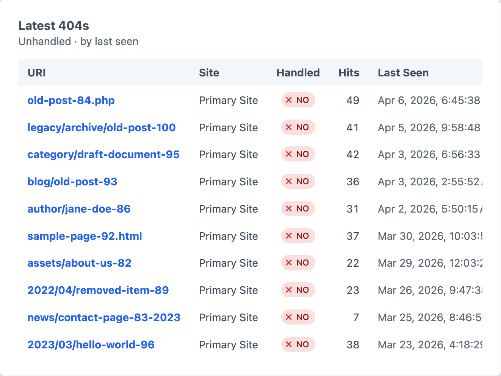
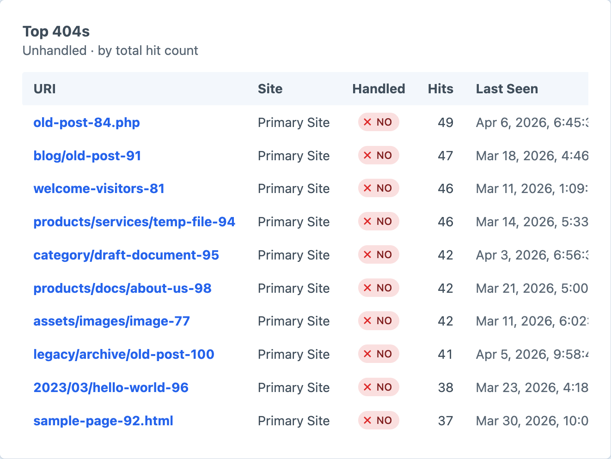
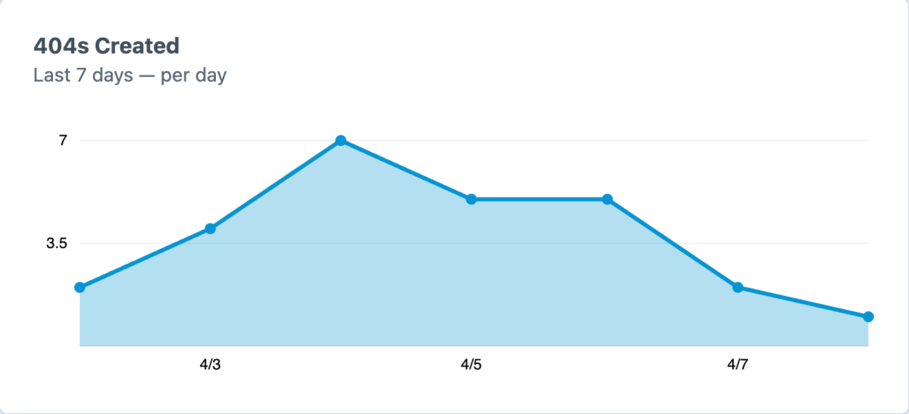
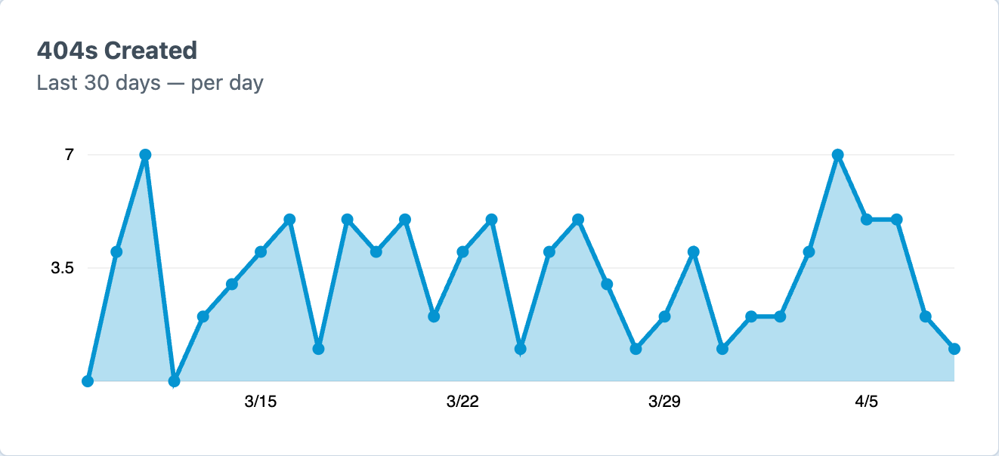

# Dashboard Widgets

The plugin provides three dashboard widget types for monitoring 404 activity. All require the `not-found-redirects:view404s` permission.

## Unhandled 404s (Chart)

A cumulative area chart showing how many 404s remain unhandled over time. Uses the redirect's creation date to determine when a 404 was "handled". The line should trend downward as redirects are created.

### Settings

- **Date Range**: Last 7 days, Last 30 days, Previous week, or Previous month

## Latest / Top 404s (Table)

A table widget showing 404 records with handled status labels, hit counts, timestamps, and quick "Add redirect" buttons for unhandled 404s.

### Settings

- **View**: "Latest 404s" (sorted by last hit time) or "Top 404s" (sorted by total hit count)
- **Status**: "Unhandled" (default), "Handled", or "All"
- **Limit**: Number of rows to display (default: 10)

## 404s Created (Chart)

An area chart showing new 404 URIs discovered over time.

### Settings

- **Display**: "Per day" (daily count of new unique URIs) or "Cumulative" (running total)
- **Date Range**: Last 7 days, Last 30 days, Previous week, or Previous month

