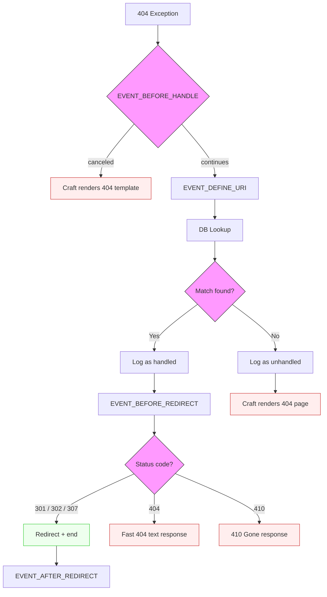

# How It Works

The plugin hooks into Craft's `ErrorHandler::EVENT_BEFORE_HANDLE_EXCEPTION` event. This fires at the **end of the request lifecycle**, after Craft's routing has already failed. This is different from Craft's [built-in redirects](https://craftcms.com/docs/5.x/system/routing.html#redirection) via `config/redirects.php`, which fire at the start of the request before a page is even rendered.

## Pipeline

Every 404 flows through this pipeline. [Events](events.md) on `NotFoundUriService` allow you to customize each stage.

1. `EVENT_BEFORE_HANDLE` fires. Cancel to skip plugin handling entirely (Craft renders its normal 404 template).
2. `EVENT_DEFINE_URI` fires. Modify the URI used for redirect matching (defaults to `$request->getPathInfo()`).
3. Exact-match redirects are checked first via a fast SQL query (filtered by `enabled`, `siteId`, `startDate`/`endDate`).
4. If no exact match, pattern and regex redirects are loaded and tested in priority order.
5. If a match is found:
   - The 404 is logged as "handled"
   - `EVENT_BEFORE_REDIRECT` fires. Modify the destination URL or cancel the redirect.
   - The visitor is redirected (301/302/307), shown a 410 Gone page, or given a fast 404 text response.
   - `EVENT_AFTER_REDIRECT` fires. Post-redirect hook for analytics or logging.
6. If no match is found, the 404 is logged as "unhandled" and the error page renders normally.
7. The referrer (if present) is recorded for audit.
