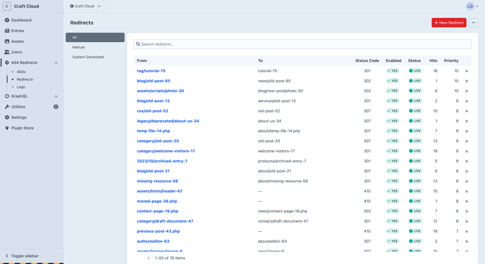
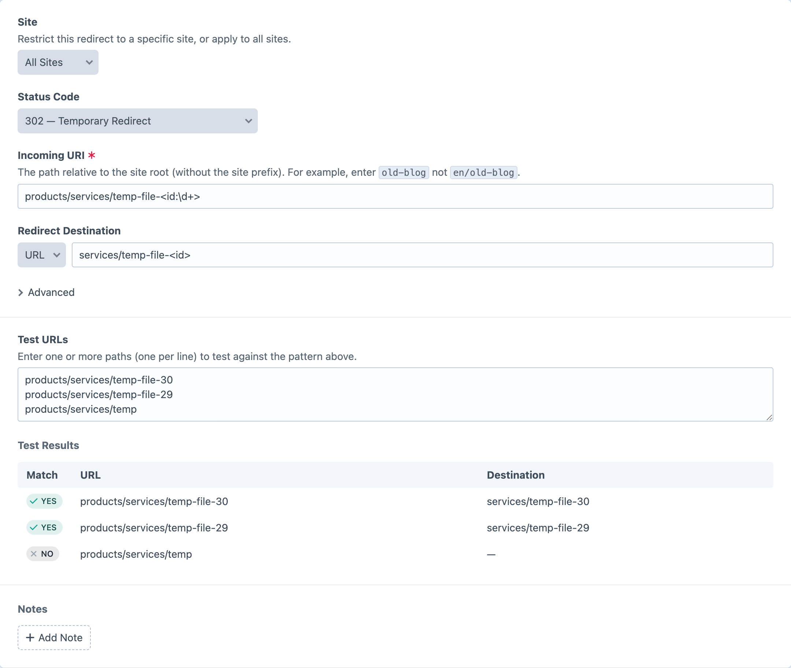
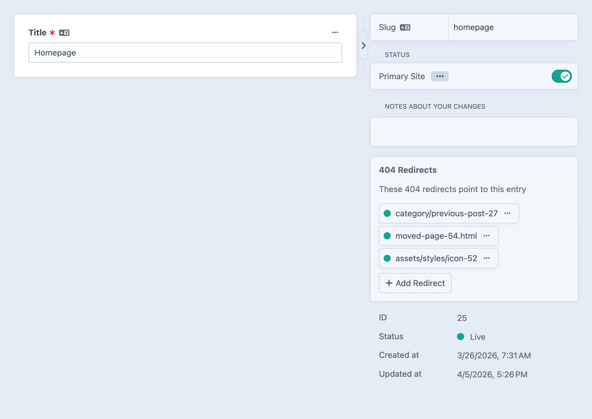

# Redirects

When the plugin [captures a 404](404-logging.md), the next step is resolving it. Redirect rules tell the plugin where to send visitors when they hit a known broken link.

Craft CMS 5.6+ includes [built-in redirects](https://craftcms.com/docs/5.x/system/routing.html#redirection) via `config/redirects.php` that fire at the **start** of the request, before a page is even rendered. This plugin's redirects work differently: they fire at the **end** of the request, only when a genuine 404 has occurred. The two systems are complementary. Craft handles known URL mappings upfront, and this plugin catches everything that falls through.

## The Redirects Index

The redirects screen shows all redirect rules with search, sort, and pagination.

Use the page sidebar to filter:

- **All**: every redirect rule
- **Manual**: redirects created by hand
- **System Generated**: redirects created automatically when element URIs change

Each row shows the source pattern, destination, status code, enabled state, status (live/disabled/pending/expired), and hit count. Entry-type destinations are displayed as element chips with status and thumbnail. In multi-site installs, a "Site" column shows which site each redirect belongs to (or "All" for global redirects). You can filter by site using Craft's standard breadcrumb site selector.

From this page you can also:

- Create a new redirect
- [Import and export](import-export.md) redirects as CSV or JSON
- Delete all redirects for a clean slate

## Creating a Redirect

You can create a redirect from several places:

- **From the redirects index**: click "New Redirect" to start from scratch
- **From a 404**: click "Create Redirect" on a 404 detail page. The incoming URI is pre-filled.
- **From an entry sidebar**: click "Add Redirect" in the incoming redirects sidebar. The destination entry is pre-filled. Opens in a slideout.

The create and edit forms are the same. Fields are pre-populated depending on how you got there.

### Fields

- **Site**: only shown in multi-site installs. Restrict the redirect to a specific site, or leave blank to apply across all sites.
- **Status Code**: 301 (permanent), 302 (temporary, default), 307 (temporary, preserves HTTP method), 404 Block (returns a plain text "404 Not Found" response for bot traffic and missing files), or 410 (gone, permanently removed).
- **Incoming URI**: the URI pattern to match. Supports exact match, Craft-style named parameters (`blog/<slug>`), and pure regex. See [Pattern Matching](pattern-matching.md).
- **Destination**: hidden for 404 and 410 status codes. Choose **URL** (relative path or full external URL) or **Entry** (select a Craft entry, URL resolves dynamically, falls back to cached URI if deleted).

### Advanced Fields

Collapsed by default:

- **Enabled**: toggle the redirect on or off.
- **Raw Regex Match**: treat the incoming URI as a raw regular expression instead of using named parameters. Used for Retour imports and advanced matching.
- **Priority**: higher values are matched first. Useful when multiple patterns could match the same URI.
- **Start Date / End Date**: schedule when the redirect is active. Useful for time-limited campaigns or planned migrations.

### Meta Sidebar

The meta sidebar on the edit screen shows:

- ID, status (live/disabled/pending/expired), hit count
- Created at/by (with user chip), updated at
- Destination entry chip (for entry-type redirects)
- Source element chip (for system-generated redirects)
- A "View Pattern Reference" button that opens a slideout with the full pattern matching reference

## Test URLs

Before saving a redirect, you can verify it works exactly as expected. Enter one URL per line and instantly see which ones match your pattern and where they'd redirect to. Results update as you type.

This eliminates guesswork when writing patterns. You'll catch false positives and missed matches before a redirect goes live, not after a user reports a broken link. For entry-type destinations, the entry's live URL is resolved so you see the real destination.

## Notes

Timestamped notes with author avatars. Add notes to record why a redirect was created, link to relevant tickets, or track changes.

System-generated notes are added automatically to track events like URI changes and entry deletions.

## Auto-Redirects on Entry URL Change

When an element's URI changes, the plugin automatically creates a redirect from the old URL to the new one. This covers:

- **Slug changes**: an editor renames an entry
- **Structure moves**: an entry is dragged to a new position
- **Parent renames**: a parent entry's slug changes, cascading new URIs to all descendants

If the same element's URI changes multiple times, existing redirects are updated to point directly to the latest URL (**chain flattening**), so visitors following any old link reach the right page in a single hop.

Auto-redirects are **not** created for new elements, drafts, revisions, duplications, bulk resaves, or cross-site propagation. Controlled by the `createUriChangeRedirects` [setting](configuration.md).

## Loop Detection

When saving a redirect, the plugin traces the redirect chain to detect loops (A → B → C → A). Self-redirects (A → A) are also blocked. At runtime, a guard prevents redirecting to the current URL.

## Entry Sidebar

When editing an entry that has incoming redirects, an **Incoming Redirects** section appears in the entry's sidebar. This shows all redirects pointing at the entry, with quick actions to edit or delete each one, and a button to add a new redirect targeting that entry.

This gives content editors full visibility into what old URLs are pointing at their content, directly from the entry editor.

