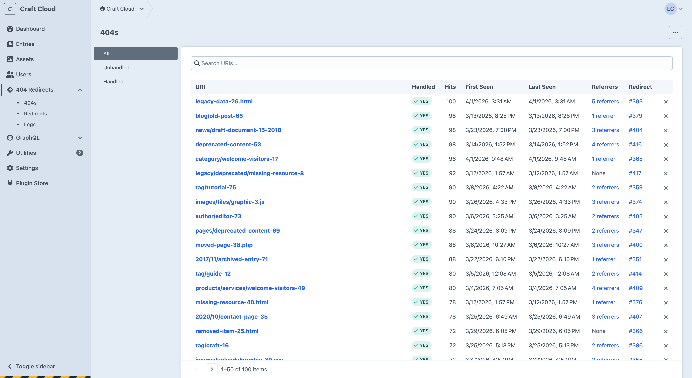

# User Interface & Experience

404 Redirects is built entirely with native Craft CMS 5.x components. No custom widgets, no third-party JavaScript frameworks, no custom CSS. It looks like Craft, works like Craft, and behaves like Craft.

Links do what you expect them to do. Actions are where you expect them to be. Buttons look like buttons.

## Why This Matters

- **No learning curve**: if you know Craft, you already know how to use this plugin
- **Predictable**: click a 404 and you see its details. Click "Create Redirect" and the URI is pre-filled. Everything works the way you'd expect.
- **Fast and responsive**: native components render quickly with no extra overhead
- **Consistent**: status indicators, chips, action menus, and form fields work exactly like they do everywhere else in Craft
- **Future-proof**: as Craft evolves its UI, this plugin evolves with it automatically

## What You'll Recognise

### CP Screens, Navigation & Sidebars

Every screen uses Craft's standard CP layout. Page titles, breadcrumbs, sidebar filters, meta sidebars, and action buttons are all in the places you'd expect. The plugin adds a "404 Redirects" section to the global navigation with subnav items for 404s, Redirects, and Logs.

### Data Tables

All listings ([404s](404-logging.md), [redirects](redirects.md), referrers) use Craft's standard admin tables with built-in search, sorting, and pagination.

### Slideouts and Modals

The [pattern matching reference](pattern-matching.md) opens in a slideout panel, the [entry sidebar](redirects.md#entry-sidebar) uses slideouts for quick redirect editing, and note editing uses a modal. The same interaction patterns used throughout Craft. No separate documentation site needed. The reference is right there while you're editing a redirect.

### Entry Sidebar

The [incoming redirects sidebar](redirects.md#entry-sidebar) appears in the entry editor using Craft's standard sidebar HTML. No iframe, no external panel, just native integration.

### Dashboard Widgets

The three [dashboard widgets](dashboard-widgets.md) (table, trend chart, and coverage chart) integrate with Craft's native widget system. Add, resize, and rearrange them like any other widget.

## The Details

The native feel extends to the small things too:

- **Status indicators**: handled/unhandled, live/disabled/pending/expired, and boolean fields all use Craft's native colour-coded status labels
- **Element chips**: entry destinations appear as element chips with status dots and thumbnails, user avatars appear on notes and in the meta sidebar
- **Action menus**: right-click or use the "..." menu on any redirect for edit, delete, and quick actions
